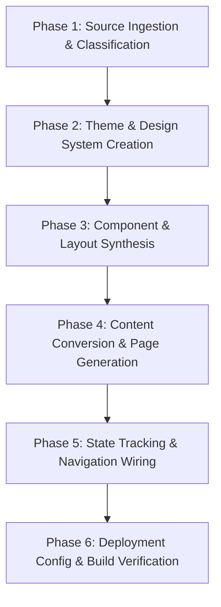
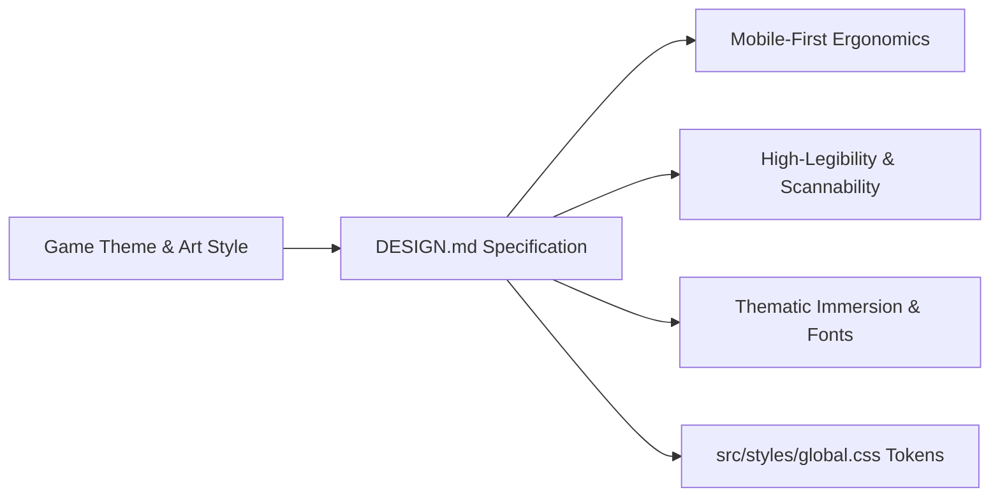

# AI System Specification: Universal Game Guide Architecture & Ingestion Blueprint

> **Role & Intent:** This document is an autonomous execution blueprint for AI coding agents. It specifies the architecture, operational invariants, design rules, and step-by-step protocol required to generate a complete, interactive, high-performance game guide website from raw source materials across any game genre (Fighting, Character-Driven, RPG, Action/Adventure, Strategy, Platformer, Roguelike, Arcade, or Database).

---

## 1. System Invariants & Non-Negotiable Rules

When constructing or modifying a game guide repository, the AI **MUST** adhere to the following core constraints:

| ID | Constraint | Description |
| :--- | :--- | :--- |
| **INV-01** | **Astro Static Generation** | Must use [Astro](https://astro.build/) configured for static output (`output: 'static'`). Zero server-side runtime, zero client JS by default. |
| **INV-02** | **Vanilla CSS + Design Tokens** | All styling must rely on CSS variables declared in `src/styles/global.css` and scoped component styles. Do **not** use Tailwind or bulky CSS frameworks unless explicitly instructed by the user. |
| **INV-03** | **Content Fidelity & Non-Omission** | **Creative freedom is encouraged** (rephrasing, improving narrative tone, polishing layout, adding diagrams), but the AI **must NEVER omit** any gameplay facts, instructions, stats, move lists, frame data, maps/locations, items/drops, secrets, choices, unlockables, side-content triggers, or combat/mechanics tips from the raw sources. |
| **INV-04** | **Navigational Contract** | The site must feature a Landing Page (`src/pages/index.astro`) serving as the entry point, providing intuitive access (via links, cards, TOC, or sidebar) to the guide pages. |
| **INV-05** | **Zero-Backend State Tracking** | User progress tracking (checklists, completed sections/chapters, unlockables, route choices, build selections) must use pure client-side persistence (e.g. `localStorage`) with defensive null-checking. |
| **INV-06** | **GitHub Pages Compatibility** | All internal links, assets, and base paths must support subpath deployment via Astro's dynamic `base` config and `import.meta.env.BASE_URL`. |

---

## 2. Directory Architecture & Customization Guidelines

> **AI Directive:** Do **NOT** copy or force rigid filenames across projects. Structure folders dynamically based on the game's genre, mechanics, and content volume.

```text
├── .agents/                          # AI workflows, conversion rules & skills
│   └── workflows/
│       ├── convert-raw-to-guide.md   # Content ingestion & formatting workflow
│       └── [game-custom-workflow].md # Game-specific scripts/prompts
├── .github/
│   └── workflows/
│       └── deploy.yml                # Automated GitHub Pages CI/CD workflow
├── public/                           # Static assets served at root
│   ├── favicon.svg                   # Guide icon
│   ├── logo.png                      # Game title logo (transparent)
│   └── [asset-buckets]/              # Thematic media (e.g. images/, maps/, sprites/, icons/)
├── raw-sources/                      # Unedited community sources (.txt, .md, .html, .json)
│   └── [source-folders]/             # Raw text dumps, wikis, tables, walkthroughs, move lists
├── src/
│   ├── components/                   # Modular components (generate ONLY what this game needs)
│   │   ├── [content-helpers]/        # E.g. Objective steps, move cards, stat blocks, boss cards
│   │   ├── [media-helpers]/          # E.g. Zoomable image lightbox, video embeds, map viewers
│   │   ├── [feedback-helpers]/       # E.g. Alert callouts, spoiler tags, type badges, tier pills
│   │   └── [interactive-widgets]/    # E.g. Completion buttons, item checklists, build selectors
│   ├── layouts/                      # Page layout templates (keep minimal)
│   │   ├── BaseLayout.astro          # Master shell (navigation, metadata, theme, mobile drawer)
│   │   └── [SpecializedLayout].astro # Optional (e.g. GuideLayout with TOC, CharacterLayout)
│   ├── pages/                        # File-based routing (Structure to mirror the game archetype)
│   │   ├── index.astro               # Landing page / Entry hub
│   │   └── [game-routes]/            # Hierarchical guide pages (see Archetypes below)
│   └── styles/
│       └── global.css                # Visual tokens, typography, layout grid, dark theme
├── astro.config.mjs                  # Astro configuration (base path & site URL)
├── package.json                      # Scripts & dependencies
├── tsconfig.json                     # Strict TypeScript configuration
├── AGENTS.md                         # Project-specific AI assistant instructions
└── DESIGN.md                         # Visual identity, theme palettes, and UI rules
```

### Route Structure Archetypes

Choose or synthesize the page hierarchy that best fits the game's actual structure:

- **Character Roster / Fighting / Competitive Games:** `src/pages/characters/[character-slug].astro`, `src/pages/movelists/...`, `src/pages/mechanics/...`, `src/pages/matchups/...`
- **Linear Story / Act RPGs:** `src/pages/walkthrough/act-[x]/chapter-[y].astro`, `src/pages/sidequests/...`
- **Stage / Mission / Level-Based Action Games:** `src/pages/stages/stage-[x].astro`, `src/pages/missions/rank-[x]/[mission-slug].astro`, `src/pages/bosses/...`
- **Open-World / Exploration:** `src/pages/regions/[region-name]/[location].astro`, `src/pages/dungeons/...`
- **Metroidvania / Area-Gated:** `src/pages/areas/[zone-slug].astro`, `src/pages/upgrades/...`
- **Databases / Encyclopedias / Dexes:** `src/pages/database/[category]/[entry-slug].astro`

---

## 3. Autonomous Execution Protocol for AI Agents

Follow this deterministic 6-phase sequence when initializing or processing a game guide:



### Phase 1: Source Ingestion & Classification
1. Scan all files in `raw-sources/`.
2. Determine:
   - Game Genre & Progression Archetype (Character Roster, Linear Walkthrough, Open-world, Mission-based, Database).
   - Content taxonomy and total volume (Characters, Chapters, Stages, Quests, Items, Move Lists).
   - Media presence (diagrams, image URLs, maps, combo/boss videos, stat tables).
   - Game-specific mechanics (e.g. bravery/HP attacks, combo notations, frame data, elemental affinities, weapon types, unlockables, missable achievements).

### Phase 2: Theme & Design System Creation
1. Create `DESIGN.md` outlining the visual identity (colors, fonts, atmospheric motifs matching the game's aesthetic).
2. Create `src/styles/global.css` with CSS custom properties:
   - Surface colors: `--bg-color`, `--bg-sidebar`, `--bg-card` (glassmorphism overlays).
   - Text colors: `--text-main`, `--text-muted`.
   - Themed accents: `--accent-primary`, `--accent-secondary`, `--accent-danger`.
   - Typography: Google Fonts for headings, body copy, and accents/notations/callouts.
   - Responsive breakpoints (Desktop, Tablet, Mobile sidebar drawer).

### Phase 3: Component & Layout Synthesis
1. Create `src/layouts/BaseLayout.astro` (responsive sidebar, header, mobile menu drawer, theme classes).
2. Generate only the components needed for this specific game's content. Common reference patterns:
   - **Content Section / Step Wrapper** (`id` anchor, section icon, title, badge slot).
   - **Encounter / Boss / Character Card** (statblocks, move lists, weaknesses, strategies, video embeds).
   - **Data / Matrix Table** (frame data, equipment stats, drop rates, skill/ability lists).
   - **Alert Callout** (`tip`, `note`, `warning`, `spoiler`, `missable`).
   - **Lightbox-enabled Media Card** (click-to-zoom for maps, movelist diagrams, and screenshots).
   - **Progress Tracker / Interactive Toggle** (connects to `localStorage`).

### Phase 4: Content Conversion & Page Generation
1. For each entry/character/chapter/stage in `raw-sources/`:
   - Transform raw markdown/text/HTML into structured `.astro` components.
   - **Apply Content Fidelity Rule:** Keep all raw data, mechanics, numbers, move notations, secrets, choices, and strategies intact while enhancing readability and presentation.
   - **Token Limit Handling:** If a raw file is large (>2,000 lines), scaffold the page with placeholders and fill sections sequentially to avoid truncation.
2. Build the Landing Page (`src/pages/index.astro`) providing intuitive entry points to the guide.
3. Build the Master Hub / Table of Contents if beneficial for the game scale.

### Phase 5: State Tracking & Navigation Wiring
1. Establish namespaced `localStorage` keys (e.g. `[game-slug]-completed`).
2. Wire up the completion / tracking buttons on guide pages.
3. Wire sidebar navigation and TOC links to reflect state (`.completed` class with `✓` badges).
4. Implement scrollspy using `IntersectionObserver` for in-page table of contents when relevant.

### Phase 6: Deployment Config & Build Verification
1. Configure `astro.config.mjs` with production base-path detection:
   ```javascript
   import { defineConfig } from 'astro/config';
   export default defineConfig({
     site: 'https://<username>.github.io',
     base: process.env.NODE_ENV === 'production' ? '/<repo-name>/' : '/',
   });
   ```
2. Verify all internal routes and assets use `${baseUrl}` interpolation:
   ```astro
   ---
   const baseUrl = import.meta.env.BASE_URL;
   ---
   <a href=`${baseUrl}characters/cloud`>Cloud Strife</a>
   ```
3. Set up `.github/workflows/deploy.yml` with `withastro/action` and `actions/deploy-pages`.
4. Run `npm run build` to verify zero TypeScript errors and successful static HTML generation.

---

## 4. Component Design Methodology (Reference-Only Concepts)

> [!IMPORTANT]
> **AI Directive — Reference-Only Mental Models:**
> Do **NOT** copy or replicate the exact names, props, or markup below. These snippets are **purely illustrative mental models** demonstrating how to write clean Astro components.
>
> What components you create, what they are named, how they are styled, and what props they accept must be **invented dynamically by analyzing `raw-sources/` and applying game-specific creativity**.

### How the AI Should Derive Components

1. **Scan for Repeating Semantic Patterns:**
   - Look at the raw text: Does the game have recurring elements like Move Lists, Frame Data, Character Matchups, Boss Stat Blocks, Dialogue Logs, Crafting Recipes, Location Coordinates, Skill Trees, Drop Rates, or Unlock Flags?
2. **Name Components Using Game-Native Terminology:**
   - Instead of generic names, use names that fit the game (e.g., `MoveCard.astro` / `BraveryAttack.astro` for Dissidia/Fighting games, `BonfireLocation.astro` for Dark Souls, `MateriaSetup.astro` for Final Fantasy, `PersonaFusion.astro` for Persona, `BountyTarget.astro` for Monster Hunter, `ComboRoute.astro` for Action games).
3. **Follow Standard Astro Component Contracts:**
   - **Strict TypeScript Props:** Always define an `interface Props { ... }` with explicit types.
   - **Slot-First Content Flow:** Use `<slot />` for rich descriptive text, markdown content, and nested children.
   - **Design Token Integration:** Use CSS variables (`var(--accent-primary)`, `var(--bg-card)`) rather than hardcoded hex colors.
   - **Zero-JS Default:** Only write `<script>` tags when client interactivity (lightbox, localStorage, filtering) is strictly required.

---

### Illustrative Conceptual Models (For Structural Reference Only)

#### Model A: Structural Anchor Container
*Demonstrates how to bind an ID anchor for navigation and table of contents:*
```astro
---
// CONCEPT ONLY: Create your own interface based on source needs
interface Props {
  id: string;
  title: string;
}
const { id, title } = Astro.props;
---
<section id={id} class="custom-game-block">
  <h3>{title}</h3>
  <div class="content-wrapper">
    <slot />
  </div>
</section>
```

#### Model B: Thematic Card / Media Embed
*Demonstrates wrapping game-specific data with themed styles and responsive slots:*
```astro
---
// CONCEPT ONLY: Adapt props to match what the raw source provides
interface Props {
  label: string;
  badge?: string;
}
const { label, badge } = Astro.props;
---
<div class="themed-card">
  <header>
    <h4>{label}</h4>
    {badge && <span class="badge">{badge}</span>}
  </header>
  <div class="card-body">
    <slot />
  </div>
</div>
```

#### Model C: Zero-Backend Client Interactivity
*Demonstrates embedding lightweight, defensive vanilla JS without framework dependencies:*
```astro
---
// CONCEPT ONLY: Implement whatever interactive state your game requires
interface Props {
  storageKey: string;
  itemIdentifier: string;
}
const { storageKey, itemIdentifier } = Astro.props;
---
<button data-track-id={itemIdentifier} class="track-btn">
  <span class="indicator">○</span>
  <slot>Toggle Status</slot>
</button>

<script>
  // Pure client-side logic with defensive null-checking
  if (typeof document !== "undefined") {
    // Read/write localStorage dynamically based on game needs
  }
</script>
```

---

## 5. DESIGN.md Authoring & Visual Identity Guidelines

`DESIGN.md` is the **single source of truth** for the visual design system. When creating `DESIGN.md` in Phase 2, the AI must establish tokens, typography, and layout rules built around four core design pillars:



### Pillar 1: Mobile-First & Touch Ergonomics
- **Mobile Viewport Priority:** Design base styles for 360px–430px mobile viewports first, expanding fluidly to tablets and wide desktop screens.
- **Touch Targets:** All interactive elements (menu buttons, TOC anchors, completion toggles, lightbox close buttons) must have a minimum hit area of **$44 \times 44\text{px}$**.
- **Mobile Navigation:** Implement a fixed top navigation bar with a slide-out hamburger drawer and an active backdrop overlay (`.sidebar-overlay`).
- **Responsive Media & Tables:**
  - Wrap wide data tables in overflow containers (`overflow-x: auto; -webkit-overflow-scrolling: touch;`).
  - Images must use `max-width: 100%; height: auto;` and trigger the high-res zoom lightbox on tap.

### Pillar 2: High Legibility & Effortless Scannability
- **Fluid Typography:** Use `clamp()` for headings and body copy to ensure text is never too small on mobile or awkwardly large on 4K monitors:
  ```css
  --font-size-body: clamp(1.05rem, 1.2vw + 0.4rem, 1.2rem);
  --font-size-h1: clamp(2rem, 5vw, 3.2rem);
  --font-size-h2: clamp(1.5rem, 3.5vw, 2.2rem);
  ```
- **Line Length & Spacing:** Constrain reading prose with `max-width: 800px–900px`, `line-height: 1.65–1.75`, and generous margins between steps/sections (`margin-bottom: 2rem–3rem`).
- **High-Contrast Dark Mode:** Guarantee at least a **7:1 contrast ratio** for primary text (e.g. bright silver/white `#eef1f6` over dark background `#0d0f14`). Avoid low-contrast gray-on-gray text.
- **Visual Milestones & Demarcation:** Distinct section borders, icons, and numbered badges allow players to glance down at their screen while playing and immediately re-orient their position.

### Pillar 3: Thematic Immersion (Matching the Game's Aesthetic)
- **Atmospheric Backgrounds:** Use high-res game key art layered underneath a fixed, dark readability gradient:
  ```css
  background-image:
    linear-gradient(rgba(13, 15, 20, 0.88), rgba(13, 15, 20, 0.94)),
    url("/images/game-wallpaper.avif");
  background-attachment: fixed;
  background-size: cover;
  ```
- **Genre-Authentic Google Fonts Pairing:**
  | Game Genre / Mood | Heading Font (`--font-heading`) | Body Font (`--font-body`) | Accents / Notations (`--font-accent`) |
  | :--- | :--- | :--- | :--- |
  | **Fighting / Competitive / Arcade** | `Russo One`, `Barlow Condensed`, `Teko` | `Inter`, `Roboto`, `Plus Jakarta Sans` | `JetBrains Mono`, `Share Tech Mono` |
  | **High Fantasy / JRPG** | `Cinzel`, `MedievalSharp` | `Spectral`, `Lora`, `Cinzel` | `Caveat`, `Marck Script` |
  | **Sci-Fi / Cyberpunk / Mecha** | `Orbitron`, `Rajdhani` | `Inter`, `Chakra Petch` | `Share Tech Mono`, `VT323` |
  | **Soulslike / Dark Fantasy** | `Cormorant Garamond`, `Cinzel` | `EB Garamond`, `Merriweather` | `Fondamento` |
  | **Modern / Action / Tactical** | `Outfit`, `Syne`, `Montserrat` | `Inter`, `Plus Jakarta Sans` | `Permanent Marker`, `JetBrains Mono` |
  | **Retro / Pixel / 8-Bit & 16-Bit** | `Press Start 2P`, `Silkscreen` | `Inter`, `DotGothic16` | `VT323` |
- **Themed Color Palettes & Accents:**
  - Base surface: Deep themed dark (charcoal, abyss blue, dark slate, void obsidian).
  - Cards: Translucent glassmorphism (`rgba(255, 255, 255, 0.05)` with `backdrop-filter: blur(8px)`).
  - Accents: Game signature colors (e.g. Radiant Gold, Neon Cyan, Energy Crimson, Emerald Rune, Arcane Violet).

### Pillar 4: Sub-Theme / Variant Architecture
- When a game includes multiple factions, characters, zones, or expansions, define sub-theme class overrides in `DESIGN.md`:
  ```css
  /* Example: Variant Theme switching accent color */
  body.character-theme-chaos,
  body.dlc-theme {
    --accent-primary: #ef4444;
    --bg-color: #0d0808;
  }
  ```

---

### Standard `DESIGN.md` File Template (Generate This in Phase 2)

```markdown
# Visual Design Guide: [Game Title] Guide

## 1. Aesthetic Direction & Tone
[Describe the visual identity matching the game's atmosphere e.g. High-Octane Arena, Dark Fantasy, Cyberpunk Neon, Medieval Epic]

## 2. Color Palette & Design Tokens
- **Background Surface:** `var(--bg-color)` (#hex)
- **Sidebar Surface:** `var(--bg-sidebar)` (#hex)
- **Card Surface:** `var(--bg-card)` (rgba glassmorphism)
- **Primary Text:** `var(--text-main)` (#hex - high contrast)
- **Muted Text:** `var(--text-muted)` (#hex)
- **Primary Thematic Accent:** `var(--accent-primary)` (#hex)
- **Secondary Thematic Accent:** `var(--accent-secondary)` (#hex)
- **High-Alert / Boss / Critical Accent:** `var(--accent-danger)` (#hex)

## 3. Typography
- **Heading Font:** '[Google Font Name]', serif/sans-serif/display
- **Body Font:** '[Google Font Name]', serif/sans-serif
- **Accent / Notation Font:** '[Google Font Name]', monospace/cursive

## 4. Mobile-First & Responsive Layout Rules
- Breakpoints: Mobile (<768px), Tablet (768px–1199px), Desktop (>=1200px)
- Touch Targets: >= 44px for all buttons and interactive anchors
- Navigation: Fixed mobile header with animated slide-out drawer
- Typography Scaling: Fluid clamp() sizing

## 5. Callouts & Semantic Indicators
- **Tips / Strategy:** Themed border with subtle background glow
- **Warnings / Missables / Traps:** High-contrast alert styling
- **Dialogue / Lore / Quotes:** Styled callout block with custom font
```

---

## 6. Anti-Patterns & Common Failure Modes

The AI must actively avoid these common pitfalls:

| Failure Mode | Reason It Fails | Correct Behavior |
| :--- | :--- | :--- |
| **Hardcoding foreign project files** | Creating components from past games that this game doesn't use | Generate only components required by the current game's source data. |
| **Summarizing / Truncating data** | Leads to players missing move notations, frame data, chests, or puzzle solutions | Maintain complete fidelity for all gameplay data, instructions, and items. |
| **Hardcoded absolute URLs (`/images/...`)** | Breaks on GitHub Pages subpaths (e.g. `/my-guide/images/...`) | Always prefix static assets and links with `${baseUrl}`. |
| **Desktop-only layout bias** | Causes cramped sidebars, unreadable tables, or tiny buttons on mobile | Design mobile-first with $\ge 44\text{px}$ touch targets and fluid text. |
| **Low-contrast text on dark cards** | Strains reader eyes and violates accessibility | Guarantee $\ge 7:1$ contrast ratio for main content text. |
| **Using heavy UI frameworks** | Bloats bundle size and reduces static speed | Stick to vanilla CSS custom properties and lightweight scoped styles. |
| **Unsafe DOM scripts** | Throws client errors if elements are missing or during SSR | Wrap in `if (typeof document !== "undefined")` and use defensive null-checks. |

