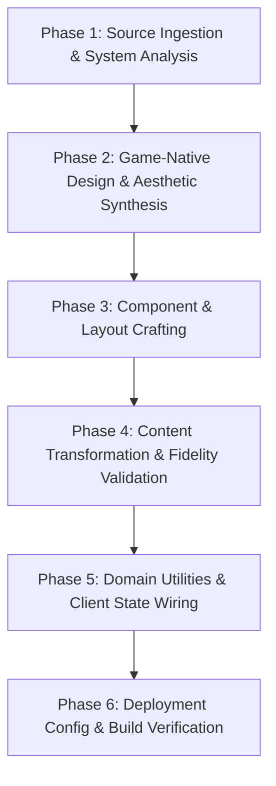

# AI System Specification: Universal Game Guide Architecture & Ingestion Blueprint

> **Role & Intent:** This document is an autonomous execution blueprint for AI coding agents. It specifies the architectural invariants, domain-driven design rules, and execution protocol required to generate a complete, interactive, high-performance game guide website from raw source materials. The agent is expected to improvise the visual identity, navigation paradigm, and domain-specific utilities to authentically mirror the target game.

---

## 1. System Invariants & Non-Negotiable Rules

When constructing or modifying a game guide repository, the AI **MUST** adhere to the following core constraints:

| ID         | Constraint                  | Description                                                                                                                                    |
| ---------- | --------------------------- | ---------------------------------------------------------------------------------------------------------------------------------------------- |
| **INV-01** | **Astro Static Generation** | Must use [Astro](https://astro.build/) configured for static output (`output: 'static'`). Zero server-side runtime, zero client JS by default. |

|
| **INV-02** | **Vanilla CSS + Thematic Tokens** | All styling must rely on CSS variables declared in `src/styles/global.css` and scoped component styles. Do **not** use Tailwind or bulky CSS frameworks unless explicitly instructed by the user.

|
| **INV-03** | **Content Fidelity & Non-Omission** | **Creative freedom is encouraged** (rephrasing, improving tone, polishing layouts, structuring data into tables/cards), but the AI **must NEVER omit** any gameplay facts, instructions, stats, move lists, frame data, maps/locations, items/drops, secrets, choices, unlockables, side-content triggers, or mechanics tips from the raw sources.

|
| **INV-04** | **Navigational Contract** | The site must feature a Landing Page (`src/pages/index.astro`) serving as the thematic entry hub, providing immediate access to the guide's primary systems, rosters, or progression routes.

|
| **INV-05** | **Zero-Backend State & Utilities** | All client-side tools (progress trackers, build calculators, fusion helpers, filter toggles, route pickers) must run purely in the browser using `localStorage` or URL params with defensive null-checking.

|
| **INV-06** | **GitHub Pages Compatibility** | All internal links, assets, and base paths must support subpath deployment via Astro's dynamic `base` config and `import.meta.env.BASE_URL`.

|

---

## 2. Directory Architecture & Customization Guidelines

> **AI Directive:** Structure folders and layouts dynamically to reflect the game's actual mechanics, volume, and UI style rather than forcing a generic template.

```text
├── .agents/                          # AI workflows, conversion rules & skills
│   └── workflows/
│       ├── convert-raw-to-guide.md   # Content ingestion & formatting workflow
│       └── [game-custom-workflow].md # Game-specific scripts/prompts
├── .github/
│   └── workflows/
│       └── deploy.yml                # Automated GitHub Pages CI/CD workflow
├── public/                           # Static assets served at root
│   ├── favicon.svg                   # Guide icon
│   ├── logo.png                      # Game title logo (transparent)
│   └── [asset-buckets]/              # Thematic media (e.g. images/, maps/, sprites/, icons/)
├── raw-sources/                      # Unedited community sources (.txt, .md, .html, .json)
│   └── [source-folders]/             # Raw text dumps, wikis, tables, walkthroughs, move lists
├── src/
│   ├── assets/                       # Optimized local media processed via Astro <Image />
│   ├── components/                   # Game-tailored UI components
│   │   ├── [content-helpers]/        # E.g. Objective steps, move cards, stat blocks, boss cards
│   │   ├── [media-helpers]/          # E.g. Zoomable map viewers, sprite sheets, embeds
│   │   ├── [feedback-helpers]/       # E.g. Alert callouts, spoiler tags, type badges, tier pills
│   │   └── [interactive-tools]/      # E.g. Fusion planners, build calculators, item checklists
│   ├── layouts/                      # Page layout shells reflecting the game's menu style
│   │   ├── BaseLayout.astro          # Master shell (metadata, base theme, core navigation)
│   │   └── [SpecializedLayout].astro # E.g. CharacterLayout, DatabaseLayout, WalkthroughLayout
│   ├── pages/                        # Dynamic page hierarchy (routes mirror game systems)
│   │   ├── index.astro               # Thematic landing hub
│   │   └── [game-routes]/            # Categorized routes (see Archetypes below)
│   └── styles/
│       └── global.css                # Visual tokens, typography, surfaces, game aesthetic
├── astro.config.mjs                  # Astro configuration (base path & site URL)
├── package.json                      # Scripts & dependencies
├── tsconfig.json                     # Strict TypeScript configuration
├── AGENTS.md                         # Project-specific AI assistant instructions
└── DESIGN.md                         # Game-specific visual identity, palettes, and UI rules

```

### Route Structure Archetypes

Synthesize the page hierarchy that best fits the game's actual structure:

- **Character Roster / Fighting Games:** `src/pages/characters/[character-slug].astro`, `src/pages/movelists/...`, `src/pages/mechanics/...`, `src/pages/matchups/...`

- **Linear Story / JRPGs / Chapter Action:** `src/pages/walkthrough/chapter-[x].astro`, `src/pages/sidequests/...`, `src/pages/endings/...`

- **Stage / Mission / Level-Based:** `src/pages/stages/stage-[x].astro`, `src/pages/missions/rank-[x]/...`, `src/pages/bosses/...`

- **Open-World / Exploration:** `src/pages/regions/[region-name]/[location].astro`, `src/pages/dungeons/...`, `src/pages/secrets/...`

- **Databases / Encyclopedias / Dexes:** `src/pages/database/[category]/[entry-slug].astro`, `src/pages/crafting/...`

---

## 3. Autonomous Execution Protocol for AI Agents

Follow this deterministic 6-phase sequence when initializing or processing a game guide:



### Phase 1: Source Ingestion & System Analysis

1. Scan all files in `raw-sources/`.

2. Identify:

- **Game Progression Archetype:** Roster-based, linear chapters, open-ended regional, or catalog database.

- **Core Game Mechanics:** Key systems (e.g., elemental weaknesses, frame data, fusion trees, crystal slots, combo routes, missable triggers, time constraints).

- **Visual Tone & Media Types:** Game HUD style, color cues, sprite vs. 3D renders, map diagrams, tables.

### Phase 2: Game-Native Design & Aesthetic Synthesis

1. Author `DESIGN.md` defining a visual style inspired directly by the game's UI and art direction.

2. Create `src/styles/global.css` with game-authentic CSS custom properties:

- **Surfaces:** Base background, surface panels, card layers, borders (e.g., modern dark, high-contrast neon pop, clean bright flat, parchment map, or retro-pixel).

- **Accents:** Game-specific color codes (e.g., element affinities, rarity tiers, faction colors, gauge meters).

- **Typography:** Select Google Fonts dynamically to reflect the game's actual typography style.

### Phase 3: Component & Layout Crafting

1. Create `src/layouts/BaseLayout.astro` with an intuitive navigation model matching the game's vibe (e.g., arcade HUD bar, RPG status menu, floating dock, or classic documentation sidebar).

2. Generate semantic components tailored to this specific game's systems (e.g., `BossStatBlock.astro`, `FrameDataRow.astro`, `FusionMatrix.astro`, `DialogueChoice.astro`, `LootTable.astro`).

### Phase 4: Content Transformation & Fidelity Validation

1. Convert raw files into structured `.astro` pages utilizing the game-tailored components.

2. **Apply Content Fidelity Rule (INV-03):** Maintain every statistic, choice outcome, secret flag, and combat instruction. Do not summarize away specific values.

3. For exceptionally large source files (>2,000 lines), break content logically into sub-pages or modular section components to ensure complete generation without truncation.

### Phase 5: Domain Utilities & Client State Wiring

1. Implement client-side utilities that directly solve pain points for this specific game (e.g., interactive checklist with `localStorage`, interactive build calculator, live search filter for large loot tables, or status-effect matchers).

2. Wire up navigation indicators (e.g., reading position scrollspy, completed item tallies, or active tab states).

### Phase 6: Deployment Config & Build Verification

1. Configure `astro.config.mjs` with production base-path handling:

```javascript
import { defineConfig } from 'astro/config';
export default defineConfig({
  site: 'https://<username>.github.io',
  base: process.env.NODE_ENV === 'production' ? '/<repo-name>/' : '/',
});

```

2. Verify all internal links, router pushes, and static assets interpolate `${baseUrl}`:

```astro
---
const baseUrl = import.meta.env.BASE_URL;
---
<a href={`${baseUrl}characters/cloud`}>Cloud Strife</a>

```

3. Set up `.github/workflows/deploy.yml` with `withastro/action` and `actions/deploy-pages`.

4. Run `npm run build` to verify zero TypeScript errors and successful static HTML generation.

---

## 4. Component & Interactivity Authoring Principles

> [!IMPORTANT]
> **AI Directive:** Do not copy boilerplate components from other guides. Derive component structure, naming, and interactive features dynamically from the game's actual mechanics.

### Deriving Game-Native Components

- **Semantic Names:** Use terms from the game's universe (e.g., `MateriaSlot.astro`, `PersonaCard.astro`, `DriveGauge.astro`, `OverdriveTrack.astro`).

- **Strict TypeScript Props:** Ensure every component exports an explicit `interface Props { ... }`.

- **Slot-First Flexibility:** Use slots for narrative walkthrough text, lore notes, or nested multi-step objectives.

- **Context-Driven Tools:** Instead of defaulting only to basic checkboxes, build utilities that fit the game's system (e.g., a quick search filter for drop rates, a build point counter, or a damage weakness matrix).

---

## 5. DESIGN.md Authoring & Visual Identity Guidelines

`DESIGN.md` is the **single source of truth** for the visual identity. The agent must dynamically determine the UI tone, layout structure, and color system based on the target game's aesthetic:

### Pillar 1: Mobile-First Ergonomics & Readability

- **Touch Targets:** Interactive targets must have a minimum hit area of **$44 \times 44\text{px}$**.

- **Fluid Layout & Typography:** Utilize `clamp()` for responsive text scaling and generous line heights ($1.65–1.75$).

- **High Contrast:** Ensure text-to-background contrast adheres to at least a **7:1 ratio** (or 4.5:1 minimum for large elements) regardless of whether the palette is dark, light, or hyper-stylized.

- **Responsive Data:** Wrap dense tables in responsive scroll containers (`overflow-x: auto; -webkit-overflow-scrolling: touch;`).

### Pillar 2: Authentic Aesthetic Immersion

- **UI Inspiration:** Replicate the mood of the game's menus (e.g., clean terminal, comic pop-art, dark fantasy ledger, neon arcade, or tactical briefing map).

- **Typography Pairing:** Dynamically find Google Fonts that match the title's visual brand (e.g., a distinct heading display font paired with a clean, highly legible body font).

- **Semantic Palette:** Map CSS variables to game-meaningful concepts rather than generic UI names:

```css
:root {
  --bg-primary: #121016;
  --surface-hud: #1a1622;
  --border-style: 2px solid #ffcc00;
  --font-heading: 'GameDisplayFont', sans-serif;
  --font-body: 'CleanBodyFont', sans-serif;

  /* Domain-specific tokens */
  --color-affinity-fire: #e74c3c;
  --color-affinity-ice: #3498db;
  --color-rarity-legendary: #f39c12;
}

```

---

### Standard `DESIGN.md` Structure (To Be Generated in Phase 2)

```markdown
# Visual Design Guide: [Game Title]

## 1. Aesthetic Direction & Inspiration

[Describe the game UI motif: e.g., Street Arcade, Dark Fantasy Grimoire, High-Chroma Pop-Art, Tactical Military HUD, Retro 16-Bit]

## 2. Dynamic Token Architecture

- **Surfaces & Layout:** [List surface, panel, and border variables]
- **Text Hierarchy:** [List primary, secondary, and accent text colors]
- **Game-Specific Accents:** [List element, faction, tier, or status colors]

## 3. Typography Selection

- **Heading Font:** '[Selected Google Font]', [Font Category]
- **Body Font:** '[Selected Google Font]', [Font Category]
- **Specialty/Code/Stat Font:** '[Selected Google Font]', [Font Category]

## 4. Layout & Navigation Paradigm

- [Describe the navigation structure: e.g., HUD tab bar, character select matrix, sidebar drawer, or chapter ledger]

## 5. Domain-Specific Component Styles

- [Define styles for boss cards, skill trees, alert callouts, or stat matrices]
```

---

## 6. Anti-Patterns & Common Failure Modes

The AI must actively avoid these pitfalls:

| Failure Mode                   | Reason It Fails                                         | Correct Behavior |
| ------------------------------ | ------------------------------------------------------- | ---------------- |
| **Clone-Stamping Past Themes** | Making every site look like a dark glassmorphism portal | Analyze the target game's actual UI and craft a tailored visual theme. |
| **Summarizing / Truncating data** | Causes players to miss move notations, frame data, or secrets | Maintain complete fidelity for all gameplay data and instructions.|
| **Hardcoded absolute URLs (`/images/...`)** | Breaks on GitHub Pages subpaths| Always prefix static assets and routes with `${baseUrl}`.|
| **Desktop-only layout bias** | Causes cramped navigation or unreadable tables on mobile| Design mobile-first with $\ge 44\text{px}$ touch targets and fluid text.|
| **Low-contrast text** | Violates legibility when referencing while gaming| Maintain high contrast ($\ge 7:1$) across all themes.|
| **Using heavy UI frameworks** | Bloats bundle size and slows loading speed| Stick to vanilla CSS tokens and lightweight scoped styles.|
| **Unsafe DOM scripts** | Throws client runtime errors during SSR/hydration| Guard browser scripts with `if (typeof document !== "undefined")` and defensive null-checks.|
